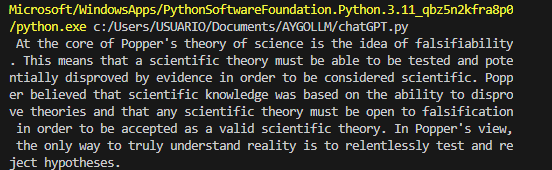
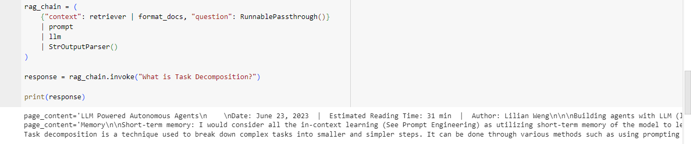
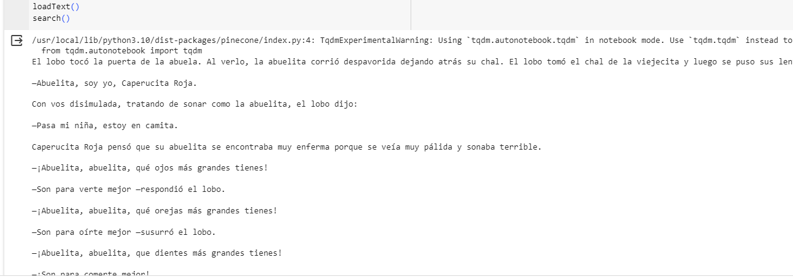
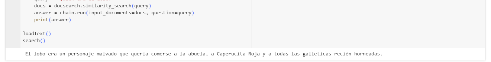

# AYGO-LLM

Este laboratorio consiste en tener una aproximacion a soluciones de inteligencia artificial basadas en large language models (LLM). Estas soluciones estan compuestas por 3 partes

1. Programa donde se envian mensajes a chatGPT y se obtienen respuestas
2. Programa tipo RAG usando una base de datos de vectores en memoria
3. Programa tipo RAG usando pinecone como servicio de base de datos y motor de busqueda sobre embeddings

## Pruebas

Se realizaron una serie de pruebas para verificar el funcionamiento de estos programas

1. Prueba del programa donde se utiliza chatGpt para enviar mensajes y recibir respuestas

2. Prueba de programa rag para realizar busqueda sobre embeddings

3. Prueba sobre programa rag donde se utiliza pinecone 

Al utilizar el resultado que arroja pinecone al realizar la busqueda por similaridad junto con un llm chain obtenemos una mejor respuesta

